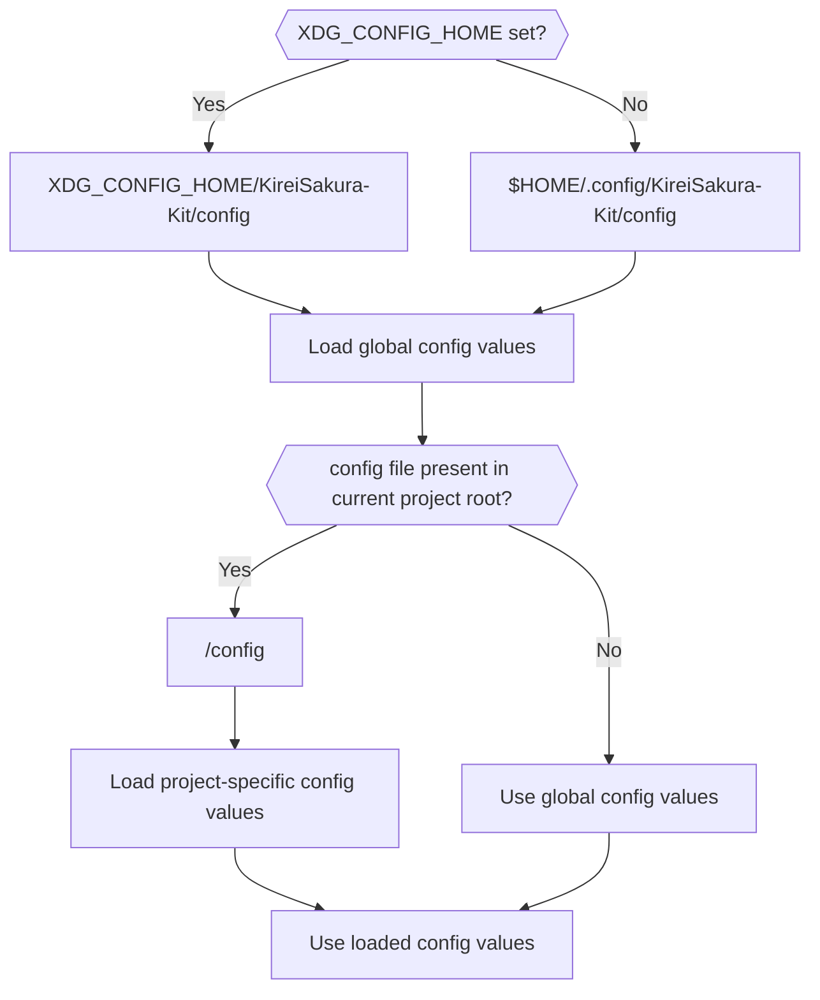

<h1 align="center"><b>Configuration File</b></h1>

The configuration file, `config.sh` allows users to customize default behaviour of the kit.

## **:simple-rocket: Quick Start**
Create a file named `config` in `.config/KireiSakura-Kit` directory &  
Add following content:

```bash
# Name of the project
project_name="Your Project Name"
```

## :fontawesome-solid-location-crosshairs: **Location of config**
- **Global:** `$XDG_CONFIG_HOME/kireiSakura-kit/config`
- **Project Specific:** `<project_root>/config`

## **:material-arrow-up: Configuration Loading Process**

The priority in which the config files are read follows below:



---

## :octicons-sliders-24: **Available Config Options**

### ==`project_name`==

- **Desc**: Specifies the name of your project.
- **Type**: string
- **Optional**: No 
- **Default**: `KireiSakura-Kit`


---

### ==`cache_dir`==

- **Desc**: Defines the directory path where KireiSakura-Kit will store temporary files.
- **Type**: string/path
- **Optional**: yes
- **Default**:
    - If `$XDG_CONFIG_HOME` is set: `$XDG_CONFIG_HOME/<project name>`  
    - Else: `~/.config/<project name>`

---

### ==`log_file_name`==  

- **Desc**: Specifies the name of the log file.
- **Type**: string
- **Location**: cache_dir/
- **Optional**: yes
- **Default**: `<project_name>.log`

---

### ==`debug_mode`==  

- **Desc**: Enable Debug mode. In this mode, extra messages are printed (helpful for debugging).
- **Type**: bool
- **Optional**: yes
- **Default**: false

---

### ==`installer_url`==  

- **Desc**: Direct URL to the installer script. This is used for installing/updating kit.
- **Type**: string/url
- **Optional**: yes
- **Default**: `https://raw.githubusercontent.com/soymadip/KireiSakura-Kit/refs/heads/install/install.sh`

---

### ==`custom_kit_dir`==
- **Desc**: Directory to use instead of default kit installation.
- **Type**: string/path
- **Optional**: Yes
- **Default**:`$XDG_DATA_HOME/<project_name>`

---

### ==`local_modules_dir`==
- **Desc**: Path of the directory that holds local modules, **relative to the project root.**
- **Type**: string/path
- **Optional**: Yes
- **Default**: modules/


