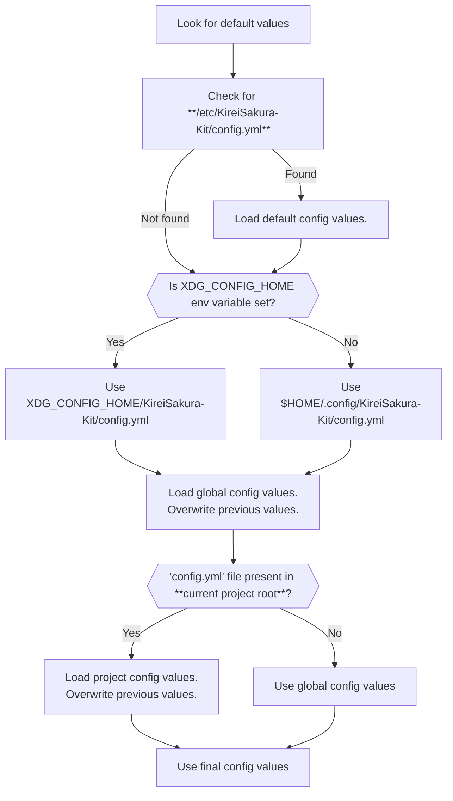

<h1 align="center"><b>Configuration File</b></h1>

!!! warning "Configuration system is not yet fully implemented"

You can **customize** or **override** the default behavior of KireiSakura-Kit using configuration files.

## :fontawesome-solid-location-crosshairs: **Configuration Files**

KireiSakura-Kit supports two levels of configuration : -

=== ":material-earth: **Global**"

    - **Applies to all projects**, overriding default settings.
    - **Primary Location:** `$XDG_CONFIG_HOME/kireisakura-kit/config.yml`
    - **Fallback Location:** `~/.config/kireisakura-kit/config.yml` _(used if `$XDG_CONFIG_HOME` is not set)_

=== ":material-folder: **Project Specific**"

    - **Applies only to the current project.**
    - **Has the highest priority**, overriding both default & global settings.
    - **Location:** `<project_root>/config.yml`

    ??? info "This config file's name can be changed!"

        **What if we want to change the project config file's name?**  

        - You can set a custom name using the **global config option:** `Project.config_file`.

---

## :material-sitemap: **Config Loading Process**

- The options set in config file overwrites their default values set by the Kit.  
- Options in Project config file overwrite global & default values.

