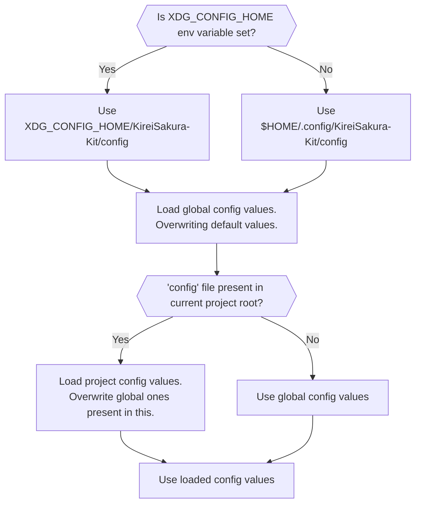

<h1 align="center"><b>Configuration File</b></h1>

The configuration file allows users to customize/override default behaviour of the kit.


## **:simple-rocket: Quick Start**
- Create a file named `kconf.ini` in `.config/KireiSakura-Kit` directory &  
- Add following content : -

    ```bash
    # Name of the project
    project_name="Your Project Name"
    ```

## :fontawesome-solid-location-crosshairs: **Location of files**
- **Global : -** 
    1. `$XDG_CONFIG_HOME/kireiSakura-kit/config`  
    2. `.config/kireiSakura-kit/config`

- **Per Project : -** `<project_root>/config`


## **:material-arrow-up: Loading Process**

- The options set in config files overwrites their default values set in the Kit.  
- Options in Project config values overwrite global & default values.


